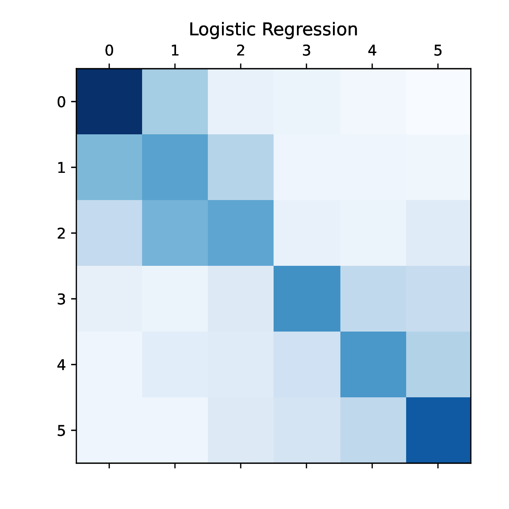
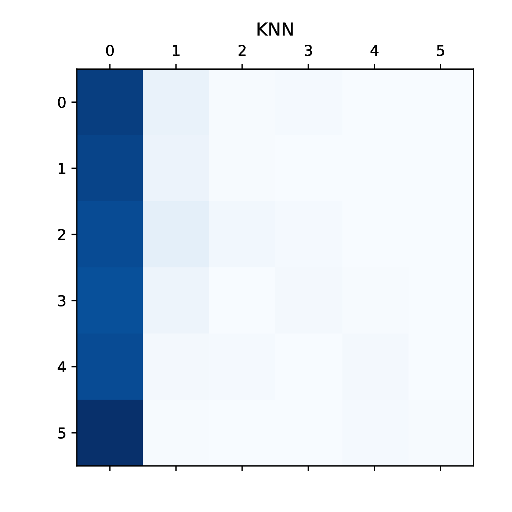
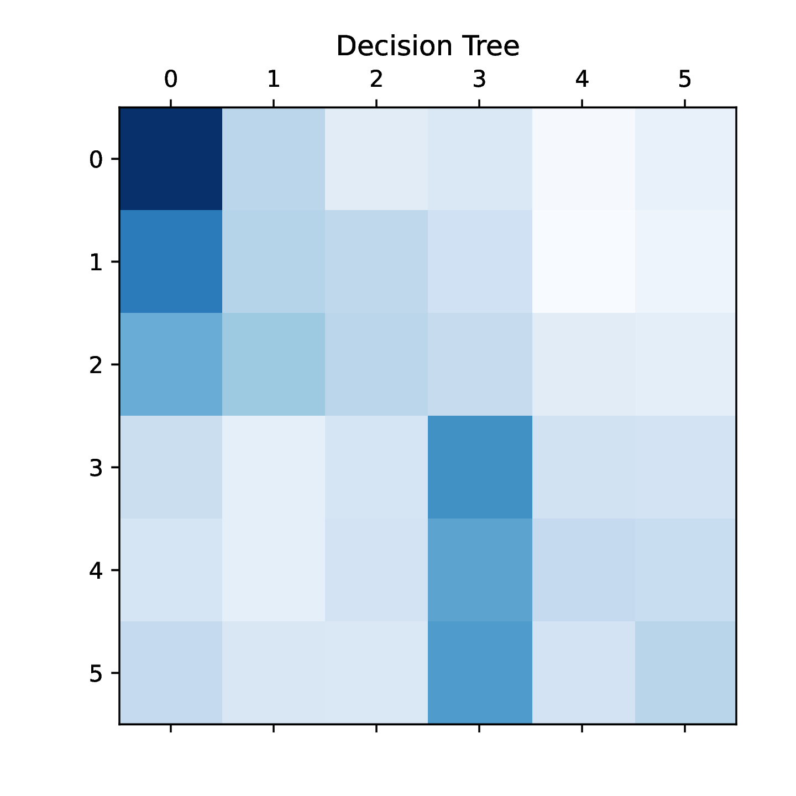
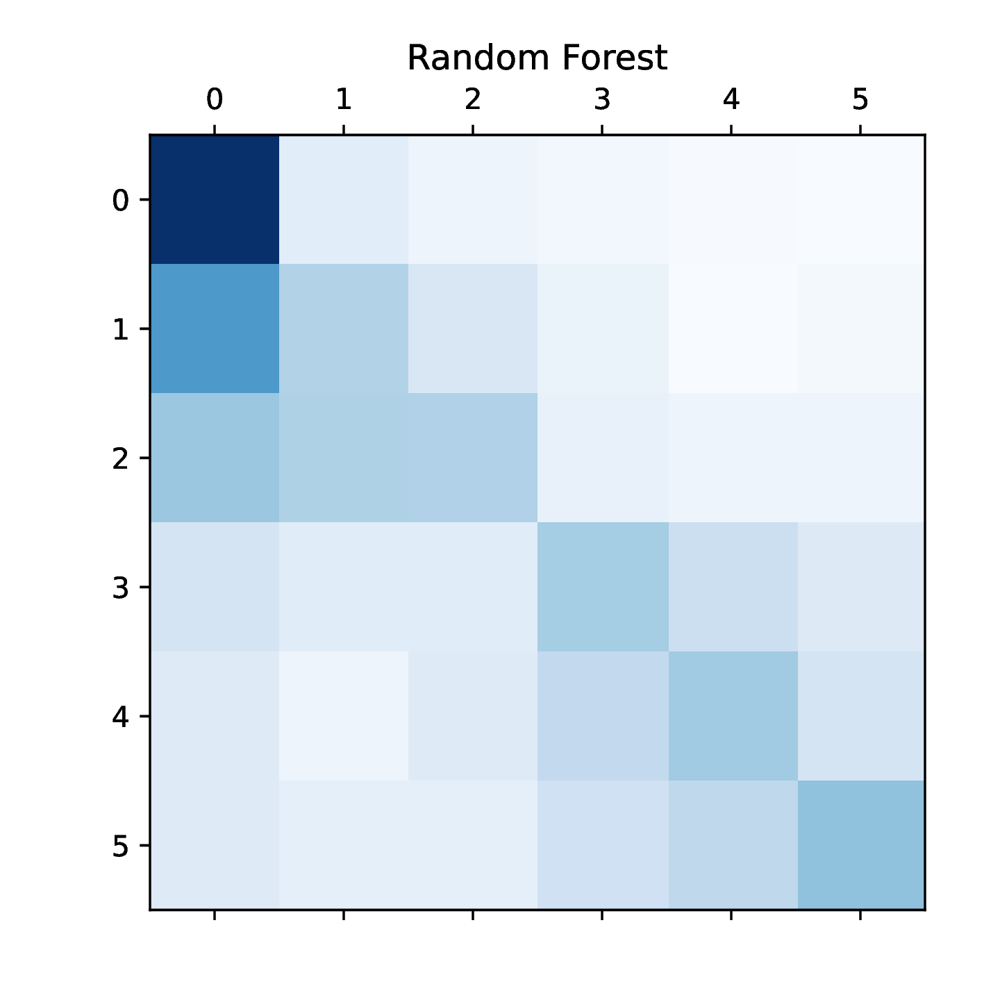

# MGT-502 Project: Predicting the difficulty of French texts with AI

Student: Beatriz Mouriño

## Setting up the environment

`conda create -n mgt502 python=3.12`

Requirements are listed in `requirements.txt`.

## Project structure

Folders are organized as follows:
- `available_datasets/`: contains the data used for the project
- `notebooks/`: contains the Jupyter notebooks used for the project (visualizing data and running standard models). 
- `src/`: contains the scripts used to run the final model (using text embedding and augmentation).
- `outputs/`: contains the outputs and plots generated during the project.

The project is divided into 3 main parts:
0. Visualizing the data to get acquainted
1. Training a standard machine learning models (no cleaning, i.e., not removing stop words) with TfidfVectorizer and MaxAbsScaler. The models evaluated are: Logistic Regression, Random Forest, KNN and Decision Tree.
2. Testing different models to find the best one. I focused on text embeddings, starting with static embeddings.
3. Analyzing the results and discussing the findings.

I also performed local tests (by splitting the training data).

## Standard models

|  Metric  | Logistic Regresssion	| KNN	| Decision Tree	| Random Forest |
| -------- | ------- | ------- | ------- | ------- |
| Precision  |  0.476  |  0.476  |  0.286  |  0.399  |
| Recall |  0.476  |  0.180  |  0.291  |  0.399  |
| F1-score   |  0.473  |  0.088  |  0.272  |  0.381  |
| Accuracy   |  0.476  |  0.180  |  0.291  |  0.399  |

## Bert embedding

I used the `transformers` library to get the embeddings from the Bert model. I used the `bert-base-multilingual-cased` model. I then used the embeddings to train a Logistic Regression model.
I tried fine-tuning the model, and tried to implement data augmentation.
